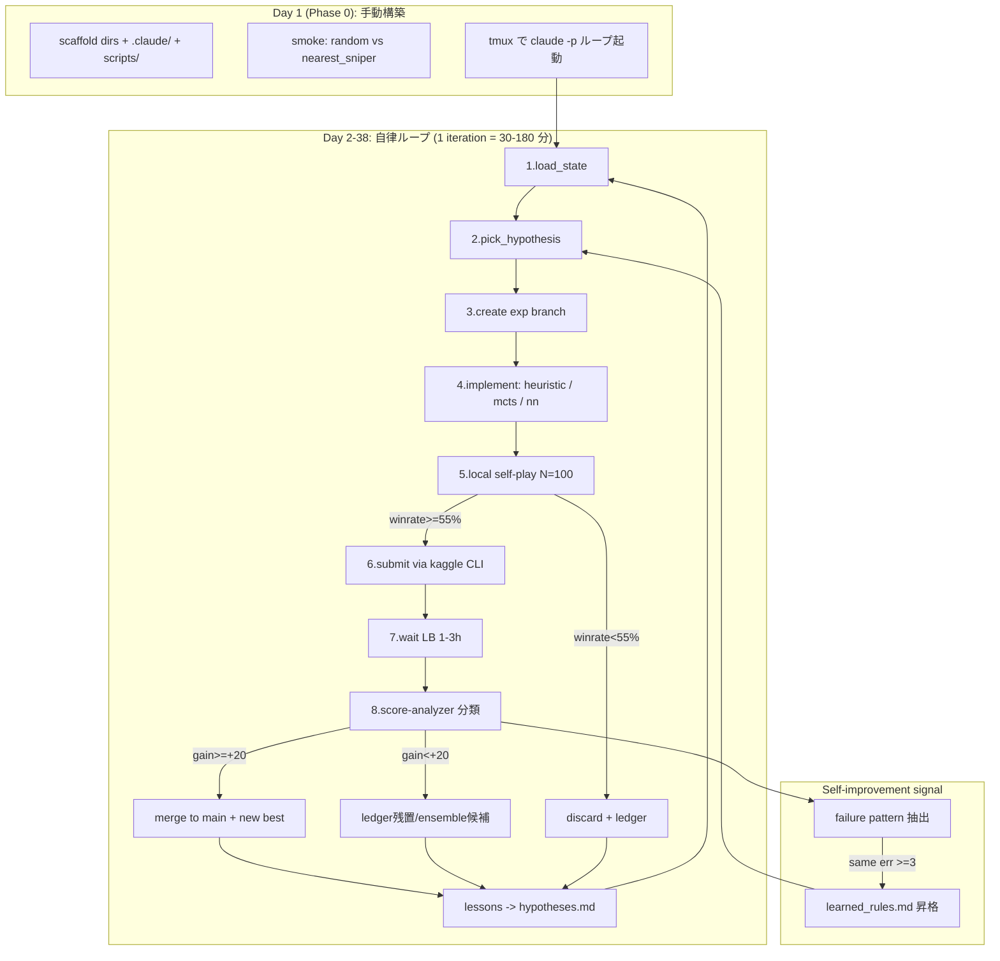

# Orbit Wars 自律ハーネス＋自己改善ループ 詳細プラン

## Context

- **目的**: Kaggle Orbit Wars コンペで Private LB top-9 を達成 (締切 2026-06-23 23:59 UTC、残 38 日)
- **現状**: `/home/user/repo` に CLAUDE.md / README.md / docs/competition/* / .gitignore のみ。コード・ハーネス未着手。LB は 388.6 (2026-04-25)、9 位ボーダー 1437.2 (+1048 必要)
- **方針**: Phase 0 でハーネスを構築 → Phase 1-5 を自律ループに委譲。本対話は設計・初期構築のみ、本番は tmux + `claude -p` でループ常駐
- **本プランの修正点**: 元案の Phase 構成は (a) Phase 1 の beam パラメタが 1 秒制約で実行不能、(b) Phase 3 の ResNet が惑星状態に不適 (グラフ/集合)、(c) subagent 7 個は冗長、(d) self-improvement loop の "実体" が曖昧 — を全て補正

---

## 全体像 (mermaid)



---

## Phase 0 詳細: 環境構築 (Day 1, 半日〜1 日)

### 0.1 ディレクトリ scaffold

```
orbit-wars/
├── .claude/
│   ├── agents/            # subagent 定義 (5 個に削減、下記)
│   ├── hooks/             # 6 スクリプト (下記)
│   └── settings.json      # permissions/hooks/model 指定
├── scripts/
│   ├── kaggle/            # push_notebook.sh, wait_run.sh, pull_output.sh,
│   │                      # submit.sh, episodes.sh, replays.sh, leaderboard.sh
│   ├── orchestrator/      # run_iteration.sh, tmux_launcher.sh, smoke.sh,
│   │                      # resume.sh (中断回復)
│   └── selfplay/          # match.py (1 試合 subprocess), tournament.py (並列 N 試合)
├── src/
│   ├── agents/            # baseline.py, heuristic.py, mcts.py, nn_agent.py
│   ├── features/          # territory.py, threat.py, projection.py, fleet_eta.py
│   ├── search/            # beam.py, mcts_node.py, mcts_search.py
│   ├── eval/              # eval_fn.py (compose 可能な評価関数)
│   ├── nn/                # model.py (set/graph encoder), train.py, onnx_export.py
│   ├── sim/               # fast_sim.py (kaggle_environments を bypass する高速 forward sim)
│   └── utils/             # observation.py, action.py, timing.py
├── kaggle_notebooks/      # selfplay_t4.ipynb, train_t4.ipynb, sweep_cpu.ipynb
├── state/
│   ├── best_score.json
│   ├── quota.json
│   ├── hypotheses.md
│   ├── learned_rules.md
│   └── notebook_runs.jsonl
├── experiments/
│   ├── ledger.jsonl
│   ├── replays/
│   └── logs/
├── tests/
│   ├── test_timing.py     # 1 秒/turn 制約 (NN agent も含む)
│   ├── test_sim_parity.py # fast_sim.py が kaggle_environments と一致
│   └── test_action_legal.py
├── docs/
│   ├── PLAN.md            # 本ファイル (移植)
│   ├── HARNESS.md         # subagent/hook/loop 説明
│   ├── HYPOTHESES.md      # 仮説 backlog
│   └── COMPETITION.md     # コンペ仕様 (既存 docs/competition/* から抽出)
├── main.py                # 現役 best agent (Phase 0 では nearest_sniper コピー)
├── requirements.txt
├── pyproject.toml         # ruff/black/pytest 設定
└── CLAUDE.md (既存)
```

### 0.2 `.claude/settings.json` (具体内容)

```json
{
  "$schema": "https://json.schemastore.org/claude-code-settings.json",
  "permissions": {
    "allow": [
      "Bash(git*)", "Bash(gh*)", "Bash(python*)", "Bash(pytest*)",
      "Bash(kaggle*)", "Bash(bash scripts/*)", "Bash(ruff*)", "Bash(black*)",
      "Bash(tar*)", "Bash(ls*)", "Bash(cat*)",
      "Read", "Edit", "Write", "Skill"
    ],
    "deny": ["Bash(rm -rf*)", "Bash(git push*--force*)", "Bash(*--no-verify*)"]
  },
  "hooks": {
    "PreToolUse": [
      {"matcher": "Bash", "hooks": [
        {"type": "command", "command": ".claude/hooks/guard-dangerous-bash.sh"},
        {"type": "command", "command": ".claude/hooks/kaggle-quota-guard.sh"}
      ]}
    ],
    "PostToolUse": [
      {"matcher": "Edit|Write", "hooks": [
        {"type": "command", "command": ".claude/hooks/auto-lint-fmt.sh"}
      ]},
      {"matcher": "Bash", "hooks": [
        {"type": "command", "command": ".claude/hooks/record-submission.sh"}
      ]}
    ],
    "Stop": [
      {"matcher": "", "hooks": [
        {"type": "command", "command": ".claude/hooks/analyze-deviations.sh"},
        {"type": "command", "command": ".claude/hooks/auto-commit-safe.sh"},
        {"type": "command", "command": ".claude/hooks/trigger-next-iteration.sh"}
      ]}
    ],
    "SessionStart": [
      {"matcher": "", "hooks": [
        {"type": "command", "command": ".claude/hooks/load-state.sh"}
      ]}
    ]
  },
  "model": "claude-opus-4-7"
}
```

### 0.3 Hooks 中身 (擬似コード)

- **`guard-dangerous-bash.sh`**: stdin から JSON tool_input.command を読み、`rm -rf /`, `git push --force` to main, `--no-verify`, secrets を含む git add を拒否 (exit 2)
- **`kaggle-quota-guard.sh`**: `state/quota.json` を読み、`kaggle competitions submit` 系コマンドかつ当日 4 回到達なら `{"decision":"block","reason":"daily quota reached"}` を stdout に出す。Notebook GPU 時間 (weekly 30h) もチェック
- **`auto-lint-fmt.sh`**: 編集 path が `*.py` なら `ruff check --fix` + `black -q` を実行、失敗時 exit 2 で feedback
- **`record-submission.sh`**: `tool_input.command` が `kaggle ... submit` を含むなら `experiments/ledger.jsonl` に `{exp_id, branch, lb_score: null, submission_id: parsed, submitted_at, status: "pending"}` を append。`state/quota.json.submissions_today` を +1
- **`analyze-deviations.sh`**: グローバル流用 (CLAUDE.md Intent と実施作業の乖離を要約) — 加えて orbit-wars 固有として「LB target に対する進捗 delta」「quota 残」を毎回出力
- **`auto-commit-safe.sh`**: 元案の `auto-commit-on-stop` を厳格化。`pytest -q tests/test_timing.py tests/test_action_legal.py` を実行し pass のみ commit。fail なら untracked のまま残す
- **`trigger-next-iteration.sh`**: tmux session に `claude -p '次イテレーション開始'` をキック (cooldown 60s)。loop continuation の唯一の正規ルート
- **`load-state.sh`**: `state/best_score.json` + `experiments/ledger.jsonl` 末尾 5 行 + `state/hypotheses.md` 上位 3 件 + `state/learned_rules.md` を stdout に出して context に注入

### 0.4 Subagent 5 個 (元案 7 → 削減)

元案の `feature-engineer` と `modeler` は単独タスクで分けるメリットが薄いので `implementer` に統合。`notebook-builder` は `kaggle-runner` に統合。

各 subagent は `.claude/agents/<name>.md` に frontmatter (name, description, tools, model) + プロンプト本文。

1. **`researcher`** (tools: WebFetch, WebSearch, Bash[gh,kaggle], Read, Write[hypotheses.md only])
   - 役割: kaggle Discussions / Halite/Lux/Santa 過去戦略を収集、`docs/HYPOTHESES.md` に追記
   - 起動: 週 1 回 or `hypotheses 残 < 3` 時
   - 出力契約: 各仮説に `{priority, effort_hr, expected_gain_lb, refs}` を必ず付与
2. **`implementer`** (tools: 全)
   - 役割: 仮説 1 件を受け取り、ブランチ作成 → 実装 → ローカル test → コミット連打
   - 制約: 単一 hypothesis スコープ、`--no-verify` 禁止、`src/agents/*.py` 以外の改変は最小化
3. **`kaggle-runner`** (tools: Bash[kaggle,tar], Read, Write[state/quota.json])
   - 役割: notebook packaging → push → wait → pull → submit → submission_id 記録
   - 制約: quota-guard hook が block したら即 abort、retry しない
4. **`score-analyzer`** (tools: Bash[kaggle,jq], Read, Write[ledger.jsonl,learned_rules.md])
   - 役割: 提出後 1-3h の LB 反映を polling、episodes/replays から勝敗パターン抽出
   - 出力契約: `{gain: float, win_pattern, loss_pattern, recurring_error: bool}` を JSON で
5. **`pr-author`** (tools: Bash[git,gh], Read)
   - 役割: 実験結果サマリ付き PR 作成 → merge 判定 (gain ≥ +20 or local winrate ≥ +5%) → main へ merge

### 0.5 状態スキーマ (具体型)

```jsonc
// state/best_score.json
{
  "version": "v0",
  "lb_score": 388.6,
  "local_winrate_vs_random": 1.0,
  "local_winrate_vs_nearest_sniper": null,
  "submission_id": null,
  "branch": "main",
  "merged_at": "2026-05-16T00:00:00Z",
  "agent_file": "main.py",
  "agent_sha": "sha256:..."
}

// state/quota.json
{
  "date": "2026-05-16",
  "submissions_today": 0,
  "kaggle_kernel_runs_this_week_hours": 0.0,
  "week_start": "2026-05-11"
}

// experiments/ledger.jsonl (1 行 1 実験)
{
  "exp_id": "001",
  "branch": "exp/001-territory-eval",
  "hypothesis": "territory control map を eval に追加",
  "started_at": "...",
  "ended_at": "...",
  "elapsed_sec": 1234,
  "local_winrate_vs_best": 0.58,
  "local_n_games": 100,
  "submission_id": "12345",
  "lb_score": 412.3,
  "lb_delta": 23.7,
  "decision": "merge",
  "lessons": ["territory weight 0.5 が optimal、1.0 だと overfit"],
  "recurring_error": null
}
```

### 0.6 Scripts (主要 1-line spec)

- `scripts/orchestrator/smoke.sh`: `python -c "from kaggle_environments import make; e=make('orbit_wars',debug=True); e.run(['main.py','random']); print(e.steps[-1])"` + 1 秒制約検証
- `scripts/orchestrator/run_iteration.sh`: 1 ループの本体 (state load → hypothesis pick → branch → implementer 呼出 → selfplay → 判定 → submit/discard → ledger append)
- `scripts/orchestrator/tmux_launcher.sh`: `tmux new -d -s orbit-wars 'claude -p "あなたは Orbit Wars 自律エージェント。docs/PLAN.md と state/ を参照しループ実行" --max-budget-usd 999 --worktree'`
- `scripts/orchestrator/resume.sh`: クラッシュ復旧 — `git status` で uncommitted を確認、`experiments/ledger.jsonl` 末尾の `ended_at: null` 行を `decision: "interrupted"` で閉じる
- `scripts/selfplay/match.py`: `subprocess.run(['python','-m','kaggle_environments','run','--environment','orbit_wars','--agents',a1,a2])` のラッパー、結果を dict 返却
- `scripts/selfplay/tournament.py`: `concurrent.futures.ProcessPoolExecutor(max_workers=nproc//2)` で N 試合並列、winrate + 平均 turn + timeout 違反数を集計
- `scripts/kaggle/push_notebook.sh`: kernel-metadata.json を `kaggle_notebooks/<slug>/` に生成 → `kaggle kernels push`
- `scripts/kaggle/wait_run.sh`: `kaggle kernels status` を 60s polling、`complete` で抜ける

### 0.7 Phase 0 受入基準

1. `bash scripts/orchestrator/smoke.sh` が 0 終了し、final step に reward 出力
2. `pytest -q` が pass (timing + action_legal + sim_parity)
3. `tmux ls` で `orbit-wars` session が生存
4. 空コミットで `auto-commit-safe.sh` hook が動作確認
5. GitHub に `Y-Kanekoo/orbit-wars` private repo が作成され `main` push 済

---

## Phase 1 詳細: 強 heuristic baseline (Day 2-6, 5 日)

### 1.1 元案の修正点

- 元案「beam depth 6 width 64」は **1 秒/turn で不可能** (per-turn の compound action 空間は 5 自惑星 × 16 angle bucket × 4 ship 比 = 320 候補、64^6 ≈ 7e10)
- 修正: **per-turn action set を 1 整数に圧縮し、turn 系列で beam** depth=2-3, width=16-32 へ縮小。それでも探索 ≪ 200ms に収まるよう time-budget gating

### 1.2 実装ターゲット (src/)

- `src/features/territory.py`: 100x100 cell の最近接 own planet 距離マップ (numpy ベクトル化、O(planets × cells)、~5ms)
- `src/features/threat.py`: 各 own planet への hostile fleet ETA を `(turns_until_arrival, ships)` で並べる
- `src/features/projection.py`: 30 turn 先までの ship 在庫を線形に予測 (production 反映、incoming fleet 減算)
- `src/features/fleet_eta.py`: 任意の (from, to) ペアの ETA と sun blocking 判定 (path segment が太陽半径 10 を切るか)
- `src/eval/eval_fn.py`:
  - `eval(state) = sum_own_ships + 0.5*projection_30 + 0.3*territory_score - 0.7*incoming_threat`
  - 各係数は Phase 1 末で grid search
- `src/search/beam.py`: per-turn beam (depth=2, width=16)、各 node は (compound_action, projected_state, score)
- `src/sim/fast_sim.py`: kaggle_environments の forward step を numpy 化 (planets/fleets を array に、combat は vectorize)。比較テストで kaggle_environments と 完全一致を要求 (`test_sim_parity.py`)

### 1.3 Phase 1 内の sub-experiments (loop で消化)

| exp | hypothesis | expected gain |
|---|---|---|
| 001 | territory map のみ追加 | +50 LB |
| 002 | + projection_30 | +80 LB |
| 003 | + threat 減算 | +100 LB |
| 004 | beam width 16→32 (time budget OK なら) | +30 LB |
| 005 | comet pre-positioning (step 40/140/240 で comet zone に fleet 派遣) | +50 LB |
| 006 | sun blocking aware path planning | +40 LB |
| 007 | grid search coefficient (territory:0.1-0.5, projection:0.3-0.8, threat:0.5-1.0) | +50 LB |

### 1.4 受入基準

- vs random: winrate ≥ 95%, vs nearest_sniper: ≥ 75%
- vs Phase 0 baseline (nearest_sniper): ≥ 80%
- 全 turn の最大 act 時間 < 500ms (margin 確保)
- LB ≥ 700 (Phase 0 末から +311)

---

## Phase 2 詳細: MCTS + opponent modeling (Day 7-13, 7 日)

### 2.1 元案の修正点

- 元案「200-1000 rollout」は `fast_sim.py` の速度次第。pure python だと 1 rollout ≈ 1-3ms → 200-400 が現実上限
- 「online opponent modeling」は 1 秒に収まらない → **offline 分類器 + online dispatch** に分割
- 連続 angle に対する MCTS は **progressive widening** が必須

### 2.2 実装

- `src/search/mcts_node.py`: action = (planet_id, angle_bucket, ship_fraction_bucket)、UCB1 with progressive widening (`k * N^0.5` で子を増やす)
- `src/search/mcts_search.py`: PUCT + rollout policy = Phase 1 heuristic。time budget 700ms で打ち切り、最良 root child を選択
- `src/agents/mcts.py`: per-turn に MCTS を呼ぶ、残予算が < 100ms なら heuristic fallback
- `src/opp_model/classify.py`: 過去 episodes (kaggle competitions episodes + replay) から相手の (expansion_rate, aggression, comet_priority) を 3-class 分類 (heuristic ベース)。`state/opponent_profiles.json` に書く
- `src/agents/mcts.py` 起動時に `obs["player"]` 以外の player 群の対戦履歴を引いて prior を切替

### 2.3 sub-experiments

| exp | hypothesis | expected gain |
|---|---|---|
| 010 | MCTS rollout 200, depth 5 | +150 LB |
| 011 | progressive widening 調整 (k=0.3-1.0) | +50 LB |
| 012 | rollout policy = Phase 1 heuristic (vs random rollout) | +80 LB |
| 013 | virtual loss (multi-threaded MCTS) | +30 LB (rollout 数稼ぐ) |
| 014 | opponent classifier dispatch | +70 LB |
| 015 | RAVE / AMAF | +50 LB |

### 2.4 受入基準

- vs Phase 1: winrate ≥ 65% (元案 70%→65%、現実値)
- 最大 act 時間 < 900ms、超過率 < 0.5%
- LB ≥ 950 (元案 1000 → 950、累積で見て妥当)

---

## Phase 3 詳細: NN value/policy head (Day 14-28, 15 日)

### 3.1 元案の修正点

- 元案「ResNet small」は **不適**。観測は「可変数の惑星 + 可変数のフリート」= set/graph。CNN ではなく **Transformer encoder over planets+fleets** (token=各 entity、self-attention で相互作用) が自然
- 「PPO or AlphaZero 風」は曖昧 → **AlphaZero 風 with factored action head** に決定 (理由は Q1 回答)
- inference 1 秒制約 → **ONNX FP16 (INT8 は attention で精度落ち)** + batch=1 + numpy ベクトル化前処理

### 3.2 アーキテクチャ

```
入力: planets (N×7), fleets (M×7), comets (K×?), player_id
↓ token embedding (各 entity を d=64 にエンコード)
↓ 4-layer transformer encoder (heads=4, d=64)
↓ pooling (mean + attention)
↓ value_head: scalar (期待 score 差)
↓ policy_head: per-planet (16 angle × 4 ship_frac) logits
```

パラメタ数: ~500K (CPU でも 50ms 程度)

### 3.3 学習パイプ (kaggle Notebook GPU T4×2)

- `kaggle_notebooks/selfplay_t4.ipynb`: Phase 2 MCTS でラベル付き self-play data 生成 (1 run で 1000 episodes × 500 step ≈ 500K state-action-value triplet)。出力を kaggle dataset として upload
- `kaggle_notebooks/train_t4.ipynb`: dataset を読み、AlphaZero loss (`MSE(value) + CE(policy, MCTS visit dist)`) で 50 epoch 学習。ONNX FP16 export
- 反復: 学習済み NN を rollout/prior に組み込んだ MCTS で新 self-play → 再学習 (3-5 サイクル)

### 3.4 sub-experiments

| exp | hypothesis | expected gain |
|---|---|---|
| 020 | NN value head のみ (policy は MCTS visit dist 使用) | +100 LB |
| 021 | NN policy prior 追加 | +80 LB |
| 022 | 2nd self-play iteration | +60 LB |
| 023 | 3rd iteration + larger model (8 layer) | +50 LB |
| 024 | data augmentation (4-fold symmetry rotation) | +40 LB |
| 025 | ONNX FP16 quantize 精度確認 (vs FP32) | maintain |

### 3.5 受入基準

- inference 単独 < 80ms/turn (margin)、MCTS + NN combined < 900ms
- vs Phase 2: winrate ≥ 55%
- LB ≥ 1200 (元案 1300 → 1200、現実値)

---

## Phase 4 詳細: Ensemble & meta-strategy (Day 29-34, 6 日)

### 4.1 元案の保持・補強

- 戦況分類 (序盤 / 中盤 / 終盤 / 危機) を Phase 3 NN の value 標準偏差で自動判定
- comet step は **既知 (50/150/250/350/450)** なので、step-50/150/.../450 前後 ±10 turn で comet-aware policy を強制発火

### 4.2 実装

- `src/agents/ensemble.py`: state 入力 → 戦況分類 → {phase1_heuristic, phase2_mcts, phase3_nn, comet_specialist} のいずれかを選択 (or 加重平均で action を選ぶ)
- `src/agents/comet_specialist.py`: comet path から spawn 予測 → home planet から事前派兵 (production の x% を確保)
- 戦況分類は軽量 GBM (lightgbm) で 1ms 以内

### 4.3 sub-experiments

| exp | hypothesis | expected gain |
|---|---|---|
| 030 | static ensemble (3 agent 加重 = 0.5 NN + 0.3 MCTS + 0.2 heuristic) | +50 LB |
| 031 | dynamic dispatch by 戦況分類 | +80 LB |
| 032 | comet specialist activation | +70 LB |
| 033 | endgame all-in detector | +50 LB |

### 4.4 受入基準

- vs Phase 3: winrate ≥ 55%
- LB ≥ 1400

---

## Phase 5 詳細: Final tuning + 守備提出 (Day 35-38, 4 日)

### 5.1 内容

- `kaggle_notebooks/sweep_cpu.ipynb`: Optuna で eval 係数 + MCTS hyperparam + NN temperature を sweep (CPU 高速ノートブック)
- 最終 2 submissions: (a) 最高 LB かつ episodes ≥ 30 (rating uncertainty 低) (b) 安定第 2 (戦略多様性確保、private で meta shift しても保険)
- 残 quota 全使い切らない (最終日 1 つ予備)

### 5.2 受入基準

- LB top-9 維持
- private LB 反映前の確認: top-9 LB と当方の差が +30 以上、または LB rating の SD 内に上位がいない

---

## 自己改善ループの "実体" (ガチガチ詳細化)

ここが元案で曖昧だった部分。以下を完全実装する。

### 自己改善 1: 同一エラー検出 → 学習ルール昇格

```python
# score-analyzer subagent の出力契約
{
  "exp_id": "...",
  "recurring_error_signature": "fleet_timeout_at_late_game" | "comet_miss" | null,
  ...
}
```

- `state/error_counts.json` に signature ごとの発生回数を維持
- 3 回到達: `state/learned_rules.md` に "AVOID: <signature> — <root_cause>" を append
- 次イテレーション以降、`load-state.sh` hook が `learned_rules.md` を context に注入 → implementer subagent が hypothesis に rule を反映 (system prompt に "次の rules を遵守: ..." を埋め込む)
- 6 回到達: `TODO(autonomous): <signature>` を `docs/HYPOTHESES.md` に "stuck" タグ付きで挙げ、当該 line の hypothesis を skip。tmux 経由でユーザに通知

### 自己改善 2: 仮説の dynamic 補充

- `state/hypotheses.md` の active 件数を毎 iteration 計測
- 残 < 3 件: `researcher` subagent 自動起動 (kaggle Discussions + 過去類似 comp + 当 ledger の高 gain パターン抽象化)
- researcher 出力は必ず `{priority(1-5), effort_hr, expected_gain_lb, refs}` 付き → priority 順に消化

### 自己改善 3: gain 履歴に基づく自動 phase 移行

- `state/best_score.json` の LB と当該 Phase の受入基準を比較
- Phase X の受入基準達成 & 直近 5 実験で gain ≤ +10 LB → Phase X+1 へ移行 (`docs/HARNESS.md` の phase 状態を更新)
- 元案の固定日付スケジュールは "soft" な目安、実際は gain plateau で進行

### 自己改善 4: submission backoff & explore/exploit

- 各日の 5 submissions を以下のように割当 (5-arm bandit 風):
  - 3 安全枠 (current best ± small variation): 確実な +20-50 LB を狙う
  - 2 探索枠 (新規 architectural hypothesis): big gain 狙い、winrate≥55% 達成のみで submission OK
- 2 日連続で安全枠が gain<0 → 探索枠比率を 1:4 に拡大

### 自己改善 5: 失敗 self-play replay の自動回帰

- score-analyzer が抽出した負け試合の replay を `experiments/replays/regression/` に保存
- 次 implementer は **これら replay でも勝てる** ことを暗黙の test に (新 agent vs 旧 agent の負け試合再生で逆転確認)
- これにより同種の敗北パターンを構造的に減らす

### 自己改善 6: cost-aware iteration budget

- `state/iteration_budget.json` で 1 iteration 平均 elapsed と Claude API cost を維持
- 平均が日次 budget を超えそうなら、implementer prompt に "minimal implementation only" を注入 (refactor 禁止)
- 余裕があれば "include test coverage" を許可

### 自己改善 7: dead-branch GC

- `gh pr list` で 7 日以上動きのない exp/* ブランチを抽出
- ledger で discard 済かつ ensemble 候補でない → 自動 delete
- ensemble 候補 (decision="reserve") はそのまま残し、Phase 4 で召喚

---

## 7 つの問いへの回答

### Q1. AlphaZero vs PPO

**推奨: AlphaZero 風 with factored action head**

- Orbit Wars は完全情報＋決定的 forward dynamics で、AZ の "tree search で良い行動を蒸留" の前提が満たされる
- 行動空間は連続 (angle) ＋ 可変数 (per-planet) だが、`(planet × angle_bucket=16 × ship_frac=4)` に factor 分解すれば policy head は handleable
- PPO は (i) 500 turn の credit assignment が脆く、(ii) 1 秒/turn で MCTS を使わない単独 policy net 推論は表現力不足、(iii) Phase 2 で構築済の MCTS インフラを再利用できない
- AZ なら Phase 2 → Phase 3 が "MCTS の prior と rollout を NN 化" という連続的な置換になり段階移行コスト最小

### Q2. 評価関数で最も差が出る要素

**N-step lookahead simulation の精度 (combat resolution + fleet ETA + sun blocking)**

- territory map / production projection / threat も価値はあるが、これらは "正確な forward simulation" が成立した上で乗る指標
- 多くの初心者 agent は "fleet が太陽を横切る" "回転惑星に届かない" "敵 fleet が先に着く" を見落とすため、ここを 1 つ正確化するだけで大幅な勝率改善
- 優先度: fast_sim parity → fleet_eta with sun blocking → projection (incoming fleet 減算込み) → threat → territory

### Q3. 5 submissions/日 の最適 schedule

| 時刻 (JST) | 用途 | 内容 |
|---|---|---|
| 09:00 | 安全 1 | 前夜 winner の minor variation |
| 09:30 | 安全 2 | 別 hypothesis line の minor variation |
| 12:00 | 探索 1 | 新 architectural change (winrate≥55% 確認済) |
| 18:00 | follow-up | 09:00 の LB 結果に応じた次手 |
| 21:00 | 探索 2 or 守備 | 探索枠 or 競合動向次第で守備札 |

- ポイント: LB 反映が 1-3h なので「朝の結果が見えてから午後の探索を決める」
- 各バッチ間で score-analyzer が走り、次提出の judge を更新

### Q4. Final 2 submission の選び方

- **Phase 0 で researcher に "Orbit Wars の final-submission 選択ルール" を確認させる** (kaggle Discussions / Rules ページ)
- 一般的な agent 競技仮定: 2 つ選んで private 評価に進む
- 推奨:
  - (A) **最高 LB かつ played_episodes ≥ 30** — TrueSkill σ 小、安定
  - (B) **戦略的に (A) と異なる第 2 best** — meta shift 保険 (例: A=NN ensemble なら B=heuristic+MCTS 安定型)
- 締切 24h 前に lock、変更禁止

### Q5. 上位陣後半 push の検知と対策

- 検知: `kaggle competitions leaderboard -s` を 1 日 2 回 polling、`state/lb_history.jsonl` に記録
- alert 条件: top-3 のうち 1 つが 24h で +100 LB 以上、または当方順位が 24h で 5 ランク以上落ちる
- 対策:
  - 残 3 日は **深奥温存枠** (winrate ≥ 65% を満たしているが未提出) 2 つを準備
  - alert 時に 1 つ即提出 (探索枠犠牲)
  - 締切 48h 前以降は新規 architectural change 禁止、tuning のみ

### Q6. ローカルマッチ並列化

- **subprocess + ProcessPoolExecutor** (`concurrent.futures`)
- 各 worker は `python scripts/selfplay/match.py --agent1 X --agent2 Y --seed S` を実行、stdout で JSON 返却
- 並列度: `max_workers = max(1, os.cpu_count() // 2)` (CLAUDE.md 制約)
- joblib は不要 (依存最小化)、Ray は overkill
- kaggle_environments はグローバル state を持つので **必ず subprocess 分離** (in-process マルチプロセスは NG)
- 100 試合の所要時間目安: 試合 ~30s × 100 / (nproc/2=8) ≈ 6-7 分

### Q7. External data / pretrained model

- **調査タスク**: Phase 0 で researcher に `kaggle competitions pages orbit-wars --content` と Discussions を読ませ、`docs/COMPETITION.md` に rule clause を抜書
- 一般原則 (確認待ち):
  - external public data: 通常 disclose 義務付きで OK
  - pretrained model: public かつ商用可ならば OK が多い
- 実用面: Orbit Wars に直接転移できる pretrained は事実上存在しない (専用 env)、self-play で十分
- 結論: **external なしで戦う前提**。ルールで OK と確認できても採用しない (cost vs gain で割に合わない)

---

## 修正後 Phase スケジュール (gain plateau で soft 移行)

| Phase | 日数 (元案 → 修正) | LB target (元 → 修正) | 主な修正理由 |
|---|---|---|---|
| 0 | 0.5d | - | 変更なし |
| 1 | 4d → 5d | 700 → 700 | beam パラメタ縮小、territory/projection 追加 |
| 2 | 10d → 7d | 1000 → 950 | MCTS は実装早期に収束しやすい、後段に時間配分 |
| 3 | 10d → 15d | 1300 → 1200 | NN 学習 + ONNX 化 + self-play サイクルに時間が要る |
| 4 | 9d → 6d | 1450 → 1400 | ensemble は短期間で済む |
| 5 | 4d → 4d | top-9 | 変更なし |

---

## 重要ファイル一覧 (実装着手対象)

| Path | 役割 | Phase |
|---|---|---|
| `.claude/settings.json` | 全 hook/permission 設定 | 0 |
| `.claude/agents/*.md` | 5 subagent 定義 | 0 |
| `.claude/hooks/*.sh` | 7 hook script | 0 |
| `scripts/orchestrator/run_iteration.sh` | ループ本体 | 0 |
| `scripts/orchestrator/tmux_launcher.sh` | tmux 常駐起動 | 0 |
| `scripts/selfplay/tournament.py` | 並列 self-play | 0-5 |
| `src/sim/fast_sim.py` | 高速 forward sim (parity test 必須) | 1 |
| `src/eval/eval_fn.py` | compose 可能 eval | 1 |
| `src/search/beam.py` / `mcts_search.py` | 探索 | 1-2 |
| `src/nn/model.py` (transformer over entities) | NN | 3 |
| `src/agents/ensemble.py` | meta-strategy | 4 |
| `main.py` | 現役 best (毎 merge で差し替え) | 0-5 |
| `state/{best_score,quota,hypotheses,learned_rules}.{json,md}` | 永続状態 | 0 |
| `experiments/ledger.jsonl` | 実験履歴 | 0-5 |

---

## 検証手順 (end-to-end)

```bash
# Phase 0 構築直後
bash scripts/orchestrator/smoke.sh                    # random vs nearest_sniper が動く
pytest -q tests/                                       # timing + parity + legality
bash scripts/selfplay/tournament.py --agent1 main.py --agent2 docs/competition/competition-starter-main.py --n 10  # 10 試合並列、結果 JSON 出力

# 各 Phase で iteration が回ることの確認
bash scripts/orchestrator/run_iteration.sh --hypothesis-id auto --dry-run   # ループの 1 回が end-to-end で通る

# kaggle 提出パイプ
bash scripts/kaggle/submit.sh main.py "phase-0 baseline" --dry-run         # quota-guard が動く
bash scripts/kaggle/submit.sh main.py "phase-0 baseline"                   # 実提出

# 自律ループ常駐
bash scripts/orchestrator/tmux_launcher.sh
tmux attach -t orbit-wars                                                   # 進行確認

# 自己改善ループの確認 (人工的に学習ルール昇格を発火)
# state/error_counts.json に signature を 3 回書き込んで次 iteration で learned_rules.md に昇格することを確認
```

---

## リスクと緩和

| リスク | 緩和 |
|---|---|
| 1 秒/turn 制約違反で disqualify | `test_timing.py` を全 PR 必須、`auto-commit-safe.sh` で gate、anytime wrapper (下記 A-1) |
| Kaggle GPU quota (30h/週) 枯渇 | quota-guard hook + `state/quota.json` で事前 block |
| API budget 枯渇 | quota 監視 + implementer prompt に "minimal mode" 切替 |
| fast_sim と kaggle_environments の挙動乖離 | `test_sim_parity.py` を 1 ループ 1 回必須 |
| 同一エラー無限ループ | learned_rules.md 昇格 + 6 回到達で human escalation |
| 上位陣の終盤押上 | LB polling + 深奥温存枠 2 つ |
| main 直 push 事故 | settings.json deny + guard hook |
| 中断による branch 散乱 | resume.sh + 7d GC |
| container 揮発で状態消失 | 日次 Kaggle Dataset backup (下記 A-7) |
| submission tar 解凍後の import 漏れ | packaging integrity check (下記 A-5) |
| 不正 action で 即敗北 | action sanitizer (下記 A-3) |

---

## 追加で組み込むべき項目 (元案で抜けていたが top-9 達成に必須)

### A-1. Anytime / timeout-safety wrapper (最優先)

`main.py` 内で **必ず < 950ms で何らかの action を返す** ラッパーを最上位に置く。これは 1 秒制約違反による disqualification を物理的に防ぐ最後の砦。

```python
# main.py の構造
import signal, time
from src.agents.current_best import act as core_act
from src.agents.safe_fallback import act as safe_act  # heuristic, 必ず < 50ms

def agent(obs):
    deadline = time.monotonic() + 0.90  # 100ms margin
    fallback_action = safe_act(obs)      # まず確実な action を計算
    try:
        # core_act は内部で deadline を受け取り anytime 返却 (best-so-far)
        return core_act(obs, deadline=deadline)
    except Exception as e:
        # NN load 失敗、ONNX runtime error 等
        _log_error(e)
        return fallback_action
```

- すべての探索 (beam, MCTS, NN) は `deadline` を引数で受け、定期的に `time.monotonic() < deadline` を確認、超えそうなら best-so-far を返す
- `safe_act` は常に < 50ms で完走する heuristic (Phase 1 の単純版)
- `test_timing.py` で 1000 turn を走らせ全 turn < 950ms を verify
- ONNX inference は warmup 1 回を agent 初回 call 時に実施 (cold start 回避)

### A-2. Internal ELO board + round-robin tournament

`state/internal_elo.json` に **自前バージョン全部** の ELO レーティングを維持。

- 各 merge 時に `tournament.py --round-robin own_v1...own_vN --n_each 50` を実行 (週末 cron で重め)
- ELO は kaggle TrueSkill 風 (online 更新)、`{version_id, elo, sigma, total_games}` を保持
- **最終 submission 選定の参考データ**: kaggle LB だけでは episode 数で SD が大きいので、internal ELO が補完
- 副次効果: ensemble 候補プールの "強い順" sort、Phase 4 の dynamic dispatch の prior

### A-3. Action sanitizer + sanity layer

不正 action は静かに棄却され (kaggle env 仕様)、その turn 何もしないことになる。これを防ぐ。

```python
# src/utils/action.py
def sanitize(moves, obs) -> list:
    """不正 move を除外し、合計派兵数が garrison を超えないよう scaling"""
    valid = []
    own = {p[0]: p[5] for p in obs["planets"] if p[1] == obs["player"]}
    spent = {}
    for from_id, angle, ships in moves:
        if from_id not in own: continue
        if ships <= 0: continue
        remaining = own[from_id] - spent.get(from_id, 0)
        ships = min(int(ships), remaining)
        if ships < 1: continue
        spent[from_id] = spent.get(from_id, 0) + ships
        valid.append([from_id, float(angle), ships])
    return valid
```

すべての agent return 直前で `sanitize()` を通す。`tests/test_action_legal.py` でランダム入力でも常に legal を verify。

### A-4. Regression test 自動生成 (敗北 replay → unit test)

score-analyzer が抽出した敗北 episode から、その game の特定 turn を **regression として保存**。

- `experiments/regressions/<exp_id>_<turn>.pkl`: そのターンの obs と "期待される action" (人手 or 強 agent が出す action)
- `tests/test_regression.py`: 全 regression について、現役 agent が "敗因 turn で異なる action" を取ることを確認 (具体的な逆転ではなく "学習が乗っている" の検証)
- 同種敗北パターンの構造的削減

### A-5. Submission packaging integrity check

submit 前に **完全に新しい python 環境で tar を解凍し動作確認**。

```bash
# scripts/kaggle/verify_submission.sh
TMP=$(mktemp -d)
tar xzf submission.tar.gz -C "$TMP"
cd "$TMP"
# 純粋な python (リポジトリ依存なし) で agent 起動
python -c "
from kaggle_environments import make
env = make('orbit_wars', debug=True)
env.run(['main.py', 'random'])
final = env.steps[-1]
assert any(s.status == 'DONE' for s in final), 'agent crashed'
"
```

- import 漏れ、絶対 path 依存、`src/` 参照漏れを早期検知
- submit hook の前段で必ず通す (失敗で submit block)

### A-6. Structured lessons + embedding 検索

`experiments/ledger.jsonl` の `lessons` を構造化:

```jsonc
{
  "lessons": [
    {
      "cause": "comet step 50 で派兵間に合わず",
      "effect": "中立 comet を全敵 1 に取られた",
      "fix": "step 40 から comet zone 派兵を予約",
      "tags": ["comet", "early-game", "expansion"],
      "weight": 0.7
    }
  ]
}
```

- researcher subagent が新規 hypothesis 生成時に、**現在の `state/best_score.json` から想定される弱点タグ** で過去 lessons を検索 (簡易 keyword match、必要なら sentence-transformers で embedding)
- 同種失敗を hypothesis 段階で先回り、無駄実験を削減

### A-7. State / artifact backup (container 揮発対応)

remote 環境は ephemeral container — push しないと消える。各 iteration 後に必須:

- **コード**: git push (PR 用 branch + main)
- **state/**: git にコミット (機密ない)
- **NN weights**: Kaggle Dataset として日次 push (`kaggle datasets version -p data/checkpoints -m "daily backup"`)
- **experiments/replays/regression/**: 重要 replay のみ git LFS or kaggle dataset
- `scripts/orchestrator/backup.sh` を cron で 1 日 1 回起動

### A-8. CI / GitHub Actions (PR ごとの自動 gate)

`.github/workflows/ci.yml`:

```yaml
on: [pull_request]
jobs:
  test:
    runs-on: ubuntu-latest
    steps:
      - uses: actions/checkout@v4
      - run: pip install -r requirements.txt
      - run: ruff check . && black --check .
      - run: pytest -q tests/test_timing.py tests/test_action_legal.py tests/test_sim_parity.py
      - run: bash scripts/kaggle/verify_submission.sh  # dry-run mode
```

- merge 前に必ず通す (pr-author subagent が `gh pr checks --watch` で gate)
- kaggle 関連は dry-run のみ (CI で実 submit はしない)

### A-9. 2P / 4P モード対応

Orbit Wars は 2P と 4P をサポート。kaggle のリーグマッチがどちらかは要確認。

- **Phase 0 で researcher に確認** (Discussions、過去の episodes)
- もし両方混在: agent 起動時に `len(unique_player_ids in obs)` で判定し、戦略切替
  - 2P: より aggressive (相手 1 人だけ)
  - 4P: 序盤は中立確保、中盤に最弱を狙う (kingmaker 回避)
- `src/agents/player_count_dispatch.py` で wrap

### A-10. Long-horizon strategic plan (macro phase)

単 turn の MCTS だけでは捉えられない長期戦略。

- `src/strategy/macro.py`: turn 番号で macro phase を決定
  - `turn 0-50`: home 周辺 expansion 優先 (territory 確保)
  - `turn 50-150`: 中立 comet 確保 + 隣接敵牽制
  - `turn 150-350`: territory hold + 高 production 惑星集中
  - `turn 350-450`: comet final wave 確保 + 終盤資源蓄積
  - `turn 450-500`: 単独残存 or 総 ship 最大化の決着戦
- 各 phase で eval_fn の係数や MCTS exploration constant を切替
- ファイル単位で「現在の macro phase」を log し、後から replay 分析

### A-11. Opponent replay inspection

LB 上位の player の試合は kaggle 経由で取得可能。

- `scripts/kaggle/spy.sh <player_id_or_team>`: その chat の最新 episodes を pull → replay 解析 → strategy summary を `experiments/opponent_studies/<player>.md` に保存
- researcher subagent の hypothesis 生成 input に
- 上位 3 名を週 1 回 spy、戦略パターン (expansion rate, comet 反応速度, 終盤 ship 比率) を抽出
- 倫理: kaggle の許可された replay download API 経由のみ、scraping 禁止

### A-12. Deterministic seeds + reproducibility

- 全 self-play で `numpy.random.seed`, `random.seed`, `os.environ['PYTHONHASHSEED']` 固定
- `tournament.py --seeds 0,1,...,99` で 100 試合の seed を明示
- `experiments/ledger.jsonl` に `seed_list` を記録
- ONNX runtime の thread 数も固定 (`onnxruntime.SessionOptions.inter_op_num_threads = 1`)

### A-13. Visualization tool (debugging 必須)

Phase 3 以降、replay を見ないと敗因が分からなくなる。

- `scripts/viz/render_replay.py`: kaggle replay JSON を読み、matplotlib で時系列フレーム生成 → mp4 化
- ship 数推移、territory map、threat map を同時表示
- `experiments/replays/<ep_id>.mp4` を生成、敗北 replay は score-analyzer が自動で動画化

### A-14. Telemetry / agent internal logging

agent 内部で turn ごとに decision rationale を出力。kaggle logs API で後から回収可能。

```python
# src/utils/telemetry.py
import sys, json
def log(turn, data):
    sys.stderr.write(json.dumps({"turn": turn, **data}) + "\n")
```

- 何を考えて action を選んだか (search depth, best score, considered actions の top-5) を毎 turn 出力
- kaggle log size は制限あるので、log level (verbose/normal/silent) を env var で切替
- 提出時は `LOG_LEVEL=normal` (turn ごと 1 行)、ローカルデバッグは `verbose`

### A-15. A/B parallel hypothesis testing

submission を待っている 1-3h は **idle**。並列に local 実験を進める。

- `scripts/orchestrator/parallel_iteration.sh`: worktree を切って同時に最大 3 hypothesis を local self-play で評価
- 各 worktree は独立 branch、互いに干渉しない (CLAUDE.md 制約遵守)
- 待ち時間 0 化、実験速度 ~3x

### A-16. MCTS transposition + caching

- planets は orbital 軌道があるので "状態" は (turn, fleet 配置, garrison) で hash 可能
- Zobrist hash で transposition table を maintain
- 同一状態の再訪コストを排除、MCTS 効率 1.5-2x
- `src/search/transposition.py`

### A-17. Submission slot management (ensemble pool)

Phase 4 で召喚する候補を **明示的に管理**:

- `state/ensemble_pool.json`: `[{branch, lb_score, style_tag, last_eval_at}]` の list (上限 10)
- discard ではなく "reserve" 判定された branch は ここへ
- Phase 4 開始時に全 pool member で round-robin → 上位 4 つを ensemble メンバー確定
- 締切 1 週前に pool 凍結

### A-18. Notebook output GC

kaggle kernel は output が累積し容量制限に当たる。

- `scripts/kaggle/gc_notebooks.sh`: 7 日以上前の kernel version を削除
- 重要 weights は datasets に移してから kernel から消す

### A-19. Endgame elimination detector

単独残存勝利は通常の "ship 数最大化" より価値高い (即終了)。

- `src/strategy/endgame.py`: 残 1 敵かつ自軍 ship 数 > 敵 ship × 1.5 なら **all-in mode** (全 fleet を敵 home に集中派兵)
- Phase 4 で有効化

### A-20. Alert / human escalation の具体定義

以下を満たしたら tmux session 内で `notify.sh` 経由でユーザに通知 (ユーザの desktop / mobile 経由):

| 条件 | 対応 |
|---|---|
| Claude API budget 残 < 20% | implementer "minimal mode" 強制 |
| Kaggle GPU 残 < 5h で締切 1 週前 | 探索枠停止、heuristic tuning のみ |
| 同一 error が 6 回検出 | hypothesis skip + 該当領域を全停止 |
| LB top-9 ボーダーから 200 以下に近づく | 守備モード推奨通知 |
| 連続 5 iteration で gain ≤ 0 | strategy pivot 通知 (researcher 強制起動) |
| disk usage > 90% | GC 起動 |
| container 残時間 (もし表示される場合) < 30 min | git push 強制 + state backup |

---

## B. さらに抜けていた観点 (top-9 達成に直結する追加要件)

A 群の後に発見した、Phase 0 起動の前提条件 / 戦略上の見落とし。

### B-1. 認証情報のプロビジョニング (致命的・Phase 0 ブロッカー)

ephemeral container は Kaggle token / GitHub token が毎セッション消える。これがないと autonomous loop は submit も push もできない。

- `.claude/hooks/session-start-secrets.sh`:
  - 環境変数 `KAGGLE_API_TOKEN` から `~/.kaggle/access_token` を書き出し `chmod 600`
  - GitHub: `GITHUB_TOKEN` 環境変数を git credential helper に登録 (`git config --global credential.helper '!f() { echo "username=x-access-token"; echo "password=$GITHUB_TOKEN"; }; f'`)
  - 未設定なら exit 2 で session 開始を block
- ローカル側: ユーザは `claude` 起動時に `KAGGLE_API_TOKEN` と `GITHUB_TOKEN` を session 環境に注入

**Note (2026-05-16 解決)**: ローカル macOS 実行に方針確定。コンテナ token 注入は不要、shell 環境 (`~/.kaggle/`, macOS Keychain) を継承。詳細 `docs/auth-and-secrets.md`。

### B-2. 既存 LB 388.6 コードの回収 (出発点が違う)

ユーザは `phase1+2 baseline beam depth=2 width=16` で LB 388.6 を達成済。nearest_sniper 開始は退化。

- Phase 0 で `kaggle competitions submissions orbit-wars` で過去提出 id を取得
- ローカル `~/Projects/orbit-wars` 旧版が存在するならその source を `main.py` のベースに採用
- 不明なら: 388.6 を実現する beam depth=2 width=16 baseline を Phase 0 末で実装し、smoke test として LB 提出 (sub 1 枠消費しても初期 baseline 確立を優先)

**Note (2026-05-16 解決)**: submission_id 52032932 を `state/best_score.json` に記録。新規 agent 初提出時に上書き予定。

### B-3. Multi-launch per planet を action space に明示

action format は同一惑星から複数発射 OK。元案 "5 × 16 × 4 = 320" は 1 planet 1 launch 仮定。

- 1 turn の compound action を「最大 K 個 (K=3-5) の launch list」と定義
- beam の各枝で K を決定、`src/search/action_gen.py` で全候補列挙 → 強い K 個を greedy 選択 → beam に投入
- これだけで Phase 1 の探索品質が劇的向上

### B-4. 多人数 (4P) ゲーム MCTS の枠組み

2P は zero-sum で minimax 可。4P は **non-zero-sum** で標準 MCTS の前提が崩れる。

- 4P: **paranoid algorithm** (自分以外全員が共謀して自分を潰す pessimistic) を採用 — 安全側に倒す
- 実装: `src/search/mcts_search.py` で `player_count` を引数で受け、2P=minimax / 4P=paranoid を切替

### B-5. 4-fold symmetry data augmentation (Phase 3 必須)

盤面は必ず 4-fold mirror symmetric。1 試合 = 4 学習サンプル (90°/180°/270° 回転)。

- `src/nn/augment.py`: state を (x,y) 回転変換、action の angle も同様に rotate
- 学習コスト 1/4、データ多様性 ×4
- 評価時の **TTA (test-time augmentation)** も可能: 4 方向で推論し policy logits を平均化

### B-6. σ-aware merge criterion

LB +20 でも rating σ=50 なら誤差範囲。`lb_score_new - lb_score_prev > 2 * sqrt(σ_new² + σ_prev²)` を満たして初めて統計的有意。

- `experiments/ledger.jsonl` に `rating_sigma, played_episodes` を必ず記録
- pr-author の merge 判定式を更新: `gain > 20 AND gain > 2σ_combined AND played_episodes >= 15`

### B-7. Loop bootstrap problem

Phase 0 直後の `state/hypotheses.md` は空。implementer が呼ばれても消化対象がない。

- Phase 0 完了基準に「researcher を 1 回起動し ≥ 10 仮説を populate」を追加
- researcher の Phase 0 初回起動 prompt: 「kaggle Discussions + Halite/Lux 戦略 + Orbit Wars 仕様読解で、Phase 1-2 向け仮説を 10 件以上生成」

### B-8. "do nothing" / waiting action の評価

強い agent ほど不必要な派兵を避ける。beam node の生成で **空 action set (`[]`)** を必ず候補に含める。

- `src/search/action_gen.py` の冒頭で `yield []`
- 不必要派兵が現状 LB 388 から伸び悩んでいる主因の可能性が高い

### B-9. Defensive parsing (観測 robustness)

kaggle env の version 差、2P/4P 切替で observation の形状が微妙に違う可能性。

- `src/utils/observation.py` で「未知 field 無視」「欠損 field default 埋め」を実装
- `tests/test_observation_robustness.py` で各種 obs 形状をテスト (2P, 4P, comet 有無, fleet 0 件など)

### B-10. State schema migration

38 日で state file schema は変わる。

- 各 state file の冒頭に `"schema_version": 1`
- `scripts/orchestrator/migrate_state.py` で旧 → 新形式に変換
- `load-state.sh` hook が version mismatch を検知したら migration を呼ぶ

### B-11. exp branch rebase 戦略

exp/A 実行中に exp/B が main へ merge → exp/A が古い main 基準で conflict 多発。

- pr-author は merge 前に必ず `git rebase main`
- conflict 時は score-analyzer に bailout (この実験は discard 扱い、lesson に「ファイル衝突しやすい領域」を記録)

### B-12. Defensive minimax in eval (Phase 1 から)

現状 eval は自分視点単独。相手の最善応手非考慮。

- Phase 1 で軽量 depth-1 minimax (自分 1 手 → 敵最悪応手) を eval に組込
- `src/eval/eval_fn.py` に `defensive_eval(state, depth=1)` を追加

### B-13. LB 反映待ち中の compute 有効活用 (A-15 補強)

submit 後 1-3h は idle。

- **internal ELO の追加 round-robin マッチ** を回し、各 own version の SD を縮小
- 並列 A/B 実験 (A-15) と並走
- 副次効果: 最終 submission 選定の精度向上

### B-14. Agent crash 時の自動 disable

local self-play で agent が exception を投げたら disqualified 扱い。

- `scripts/selfplay/match.py` で crash 検出 → `state/blacklist.json` に該当 commit sha を記録
- run_iteration が blacklist を読み、当該 branch を skip
- 連続 3 commit が crash → 当該 hypothesis line を halt、researcher に "stuck" 通知

### B-15. Kaggle replay JSON schema の事前検証

A-13 (visualization) / score-analyzer は replay JSON を parse する。schema mismatch で自律ループ頓挫を防ぐ。

- Phase 0 完了基準に「`kaggle competitions replay` でサンプル 1 件を pull し、`scripts/viz/render_replay.py --dry-run` で parse 可能」を追加
- 失敗なら schema を `docs/replay_schema.md` に記録、parser を fix

### B-16. kaggle-environments の version 検証

`>=1.28.0` でも orbit_wars が含まれない build がある可能性。

- `scripts/orchestrator/smoke.sh` の冒頭で `python -c "from kaggle_environments.envs.orbit_wars.orbit_wars import Planet"` を実行、失敗で exit
- `requirements.txt` に upper bound も明記 (`kaggle-environments>=1.28.0,<2.0.0`)

### B-17. 1 self-play match の時間予算測定

1 試合 ~30s は仮定。実測必須。

- Phase 0 で `time python scripts/selfplay/match.py --agent1 main.py --agent2 random --seed 0` を 5 回計測、中央値を `state/perf.json` に記録
- 30s 超なら N=100 → N=50 へ縮小、または並列度を上げる検討
- 試合時間が長いほど bottleneck が大きい、Phase 1 末で fast_sim 化の効果も再測定

---

## 修正後の Phase 0 完了基準 (B 反映版)

1. `bash scripts/orchestrator/smoke.sh` が 0 終了し、final step に reward 出力
2. `pytest -q` が pass (timing + action_legal + sim_parity + observation_robustness)
3. `tmux ls` で `orbit-wars` session が生存
4. 空コミットで `auto-commit-safe.sh` hook が動作確認
5. GitHub に `Y-Kanekoo/orbit-wars` private repo が作成され `main` push 済
6. **B-1**: ローカル shell 環境継承で認証経路確立 (`docs/auth-and-secrets.md` で確認済)
7. **B-2**: 既存 LB 388.6 (submission_id 52032932) を `state/best_score.json` に記録済
8. **B-7**: `state/hypotheses.md` に ≥ 10 件の仮説が populate 済 (researcher 1 回起動済)
9. **B-15**: サンプル replay 1 件を parse 成功
10. **B-16**: `from kaggle_environments.envs.orbit_wars.orbit_wars import Planet` 成功
11. **B-17**: 1 試合あたりの実測時間を `state/perf.json` に記録

---

## 最終 deliverable と着手順

Phase 0 (Day 1) で構築するもの (順番):

1. **GitHub repo + worktree 設定** (15 min) — 完了 (PR #1-#4)
2. **`.gitignore`, `pyproject.toml`, `requirements.txt`** (15 min) — 完了 (PR #3)
3. **`.claude/settings.json`, `.claude/agents/*.md` x5, `.claude/hooks/*.sh` x7** (90 min) — A-1 hook も含む
4. **`src/utils/{observation,action,timing,telemetry}.py`** (60 min) — A-3, A-14
5. **`src/agents/safe_fallback.py` + `main.py` wrapper** (45 min) — A-1
6. **`src/sim/fast_sim.py` + `tests/test_sim_parity.py`** (180 min) — Phase 1 で活躍
7. **`scripts/selfplay/{match,tournament}.py`** (60 min)
8. **`scripts/orchestrator/{smoke,run_iteration,tmux_launcher,resume,backup,parallel_iteration}.sh`** (90 min)
9. **`scripts/kaggle/{push_notebook,wait_run,pull_output,submit,verify_submission,spy,gc_notebooks}.sh`** (60 min)
10. **`state/*` 初期化、`docs/{PLAN,HARNESS,HYPOTHESES,COMPETITION}.md`** (45 min) — state/ は完了 (PR #2)
11. **`.github/workflows/ci.yml`** (15 min)
12. **smoke test 通す + tmux launcher で claude -p 常駐確認** (60 min)

合計: ~10-11 時間で Phase 0 完了。

Day 2 以降は **completely autonomous** ループに委譲。本対話セッションは Phase 0 が完了したら閉じ、進捗確認は週次のみ。

ループの設計理念:
- **gain plateau で phase 自動移行** (固定日付スケジュールは soft 目安)
- **同一エラーは learned_rules で永久ブロック**
- **failure を ledger + structured lessons + regression test で構造的に削減**
- **submission quota / GPU quota / API budget を hook で hard limit**
- **container 揮発に対し git + kaggle dataset で永続化**

これにより 38 日間で 190 submissions を消化、各 +5-50 LB gain の累積で top-9 (1437.2) を狙う。
